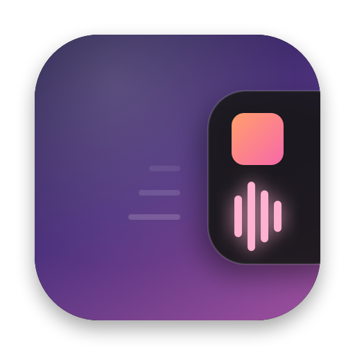
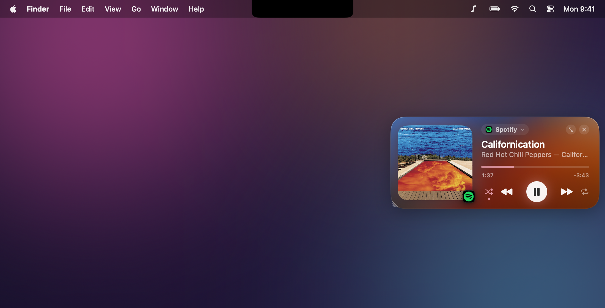
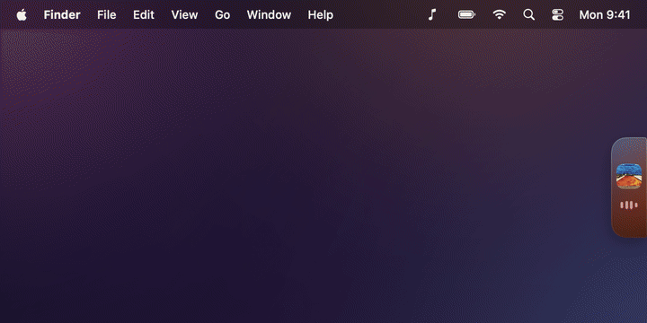
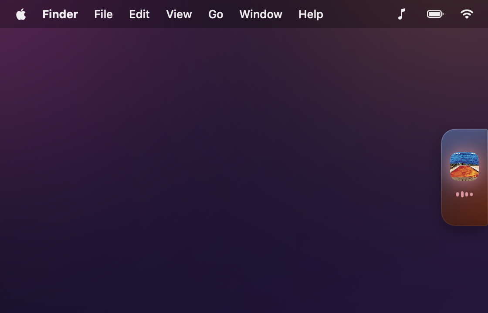
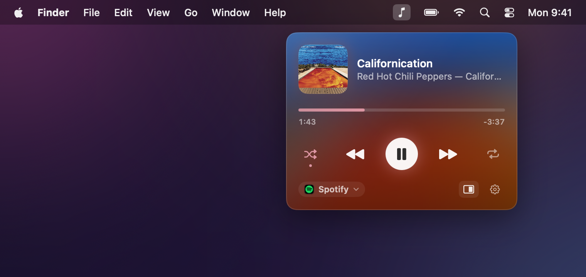
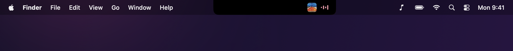
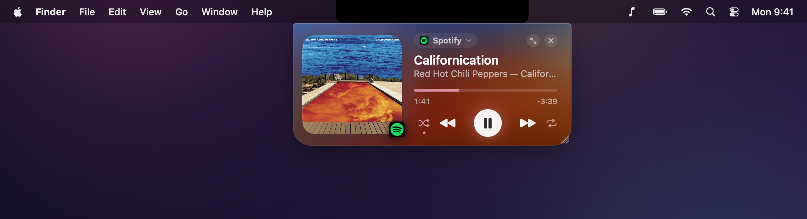
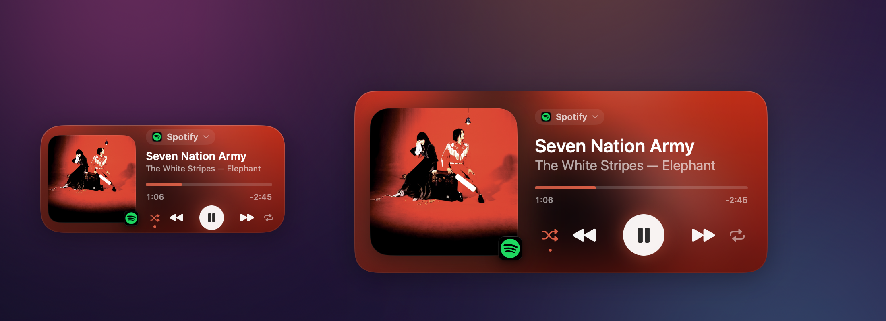

<p align="center">
  
</p>

<h1 align="center">SideTune</h1>

<p align="center">
  A floating now-playing player for macOS that lives on the side of your screen.<br>
  Snap it to any edge, tuck it beside the notch, or leave it floating.
</p>

<p align="center">
  
  
  <a href="../../releases/latest"></a>
</p>

<p align="center">
  
</p>

## Features

- **Any player.** Spotify, Apple Music, browsers, VLC and anything else macOS shows as Now Playing.
- **Drag it anywhere.** A magnet pulls it to edges and corners, and it springs into place.
- **Collapses into a tab.** Docked, it shrinks to a slim tab with the artwork and a live equalizer. Hover it to open the full player, or keep it open all the time.
- **Beside the notch.** Drop it at the top next to the notch and it becomes part of the notch.
- **Pin the app it controls.** By default it follows whatever is playing. Pin Spotify, Music, a browser or any other player and it sticks to that app. A pinned Spotify or Music keeps the controls even when a browser starts playing.
- **Shuffle and repeat** for Spotify and Music.
- **Resizable**, tinted by the album artwork, with lots of small animations.
- **Menu bar mini player** next to battery and Wi-Fi.

<p align="center">
  
</p>

<table>
  <tr>
    <td></td>
    <td></td>
  </tr>
  <tr>
    <td align="center">Collapsed tab</td>
    <td align="center">Menu bar mini player</td>
  </tr>
</table>

<p align="center">
  <br>
  
</p>

<p align="center">
  
</p>

## Installation

1. Download **SideTune-*version*.dmg** from the [latest release](../../releases/latest).
2. Open it and drag **SideTune** into **Applications**.
3. SideTune isn't notarized, so the first time, right-click it in Applications and choose **Open**. Or run:

   ```sh
   xattr -dr com.apple.quarantine /Applications/SideTune.app
   ```

Requires macOS 14 Sonoma or later.

## Using it

| To | Do this |
| --- | --- |
| Move it | Drag the player |
| Dock it | Drop it near any edge |
| Place it without snapping | Hold <kbd>⌥</kbd> while dragging |
| Put it beside the notch | Drop it at the top, next to the notch |
| Keep it open while docked | Click <kbd>⤢</kbd> on the card |
| Resize | Drag the grip in the card's corner |
| Hide / show | Click <kbd>×</kbd>, throw it off-screen, or press <kbd>⌥</kbd><kbd>⌘</kbd><kbd>M</kbd> |
| Pin the app it controls | Click the app name on the card and choose an app, or **Automatic** |
| Open the playing app | Click the artwork |

Right-click the menu bar icon for sizes, the notch, and settings.

The first time you pin Spotify or Music, or use shuffle or repeat, macOS asks to let SideTune control that app.

## Building from source

You need the Xcode Command Line Tools and `cmake` (`brew install cmake`). Full Xcode isn't required.

```sh
git clone <this repo>
cd SideTune
scripts/build-app.sh          # → build/SideTune.app
open build/SideTune.app
```

| Script | What it does |
| --- | --- |
| `scripts/test.sh` | Runs the tests |
| `scripts/screenshots.sh` | Renders the images in `docs/` |
| `scripts/release.sh 1.0.0` | Builds the universal `.dmg`, `.zip` and source archive into `dist/` |

## How it works

Since macOS 15.4, only Apple's own apps can read what's playing. SideTune uses [mediaremote-adapter](https://github.com/ungive/mediaremote-adapter), which reads it through the system's `/usr/bin/perl`, the same approach [boring.notch](https://github.com/TheBoredTeam/boring.notch) uses. Pinned Spotify and Music are controlled directly with AppleScript.

## Credits

- [mediaremote-adapter](https://github.com/ungive/mediaremote-adapter) by ungive (BSD-3-Clause), bundled in `Vendor/`
- Inspired by [boring.notch](https://github.com/TheBoredTeam/boring.notch)
